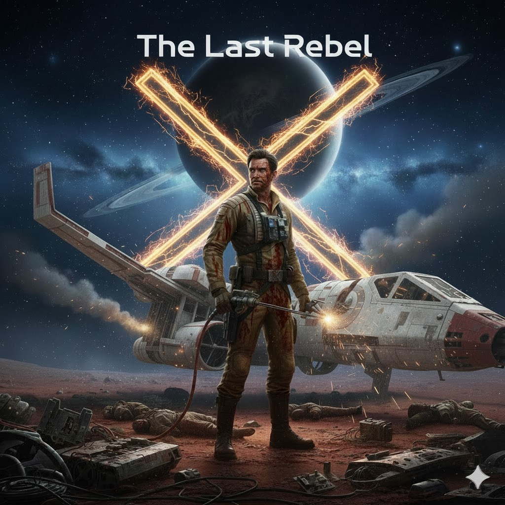

# 🚀 MY C++ ADVENTURE SURVIVAL PROJECT(text-console)



 Это мой второй серьезный проект – своего рода веха на моем пути. В этот раз, в первую очередь, я создавал его для себя, прислушиваясь к внутреннему голосу. 
 Если моя работа вдохновит кого-то еще, я буду рад видеть в этом подтверждение своего постепенного творческого роста.
 Я вижу в этом свой постепенный маленький путь прогресса, всем удачи ребят. (не буду лгать не знал насчет std::any_of поэтому в этом подсказал gpt, а знаете он хороший друг)

 ## GAMEPLAY (explanation for the icons)
| Символ | Описание | Примечание |
| :---: | :--- | :--- |
| **`[p]`** | **Вы (Персонаж / Игрок)** | Передвижение по карте |
| **`[#]`** | **Непроходимая Стена** | Граница карты |
| **`[X]`** | **Электрическая Ловушка** | Наносит урон (`-15 HP`). |
| **`[@]`** | **Активный Портал** | Цель уровня. Появляется после сбора всех деталей. |
| **`[&, <, T...]`** | **Детали Корабля** | Части, необходимые для починки вашего судна. |
| **`[.]`** | **Пол / Пустое Пространство** | Безопасная зона для перемещения. | 
## MOVEMENT 
| Клавиша | Действие           |
|---------|--------------------|
| W       | Перемещение вверх  |
| A       | Перемещение влево  |
| S       | Перемещение вниз   |
| D       | Перемещение вправо |


## Synopsis (Сюжет) 
Вы — последний инженер-повстанец, из всего экипажа вашей команды.
Чудом выживший после крушения на враждебной инопланетной планете. 
Ваш космический корабль разбит, вы абсолютно одни, устройство для связи со станцией разбито, а пины на проводах оплавились и сгорели из-за смертельного короткого замыкания. 
Единственный путь к выживанию — найти и собрать всевозможные детали для починки вашего корабля "Штурмовик ARC-170 (Aggressive ReConnaissance-170)", которые разбросанные по уровням.
Их нужно собрать, чтобы активировать таинственный межпространственный портал и зайти в него, для того чтобы двигаться дальше, потому что, планета опасна на каждом шагу, будьте осторожны!

## Цель Игры 
1. Основная задача игрока — выжить и сбежать с планеты, проходя уровни. 0 уровень - пролог для того чтобы ознакомиться с игрой.
2. Сбор Деталей: На каждом уровне, начиная с Level 1, портал заблокирован. Чтобы его открыть, необходимо найти и собрать все Детали Корабля (обозначены символами &, <, T...). 
3. Активация Портала: Как только последняя деталь будет подобрана, портал [@] активируется.
4. Переход: Зайти в портал, чтобы перейти на следующий, более сложный уровень -> больше ловушек и деталей для сбора.
5. Угрозы: Избегайте Электрических Ловушек ([X]), которые наносят урон (-15 HP). Если ваше здоровье упадет до нуля, игра будет завершена. Вы будете мертвы.


## 🎮 Как запустить
### 1. Создайте папку под игру
```bash
mkdir Game 
``` 
### 2. Перейдите в эту папку 
```bash 
cd Game 
```
### 3. Скачайте / Клонируйте  
- git clone [https://github.com/felonine/The-Last-Rebel](https://github.com/felonine/The-Last-Rebel)

# создание исполняемого файла название выбираете сами)
# Если используете g++ 
``` bash
g++ main.cpp Game.cpp CellPlayer.cpp -o play.exe
``` 
### Запуск исполняемого файла
``` bash 
./game.exe 
```

## 💢 Как играть

1 — Собрать детали, чтобы починить корабль и сбежать с планеты

2 — Уклоняться от движующихся ловушек 

3 — Войти в портал, который появится после всех собранных деталей на данном уровне

💡 Будущие обновления
- Новые уровни
- Новые квесты, новые сложности
- Книга по игре (лор об игре)
- Новая карта и ловушки 

🤝 Контакты
# Автор: FELONINE
# ТГШКА: @WhiteKatanV_BloodyGuys
# GitHub: https://github.com/felonine

## ENG VERSION 💫
# 🚀 MY C++ ADVENTURE SURVIVAL PROJECT (TEXT-CONSOLE)


This is my second serious project, marking a sort of milestone on my journey. This time, I primarily created it for myself, following my inner voice.
If my work inspires someone else, I will be happy to see it as confirmation of my gradual creative growth.
I see this as my slow, small path of progress. Good luck to everyone. (I won't lie, I didn't know about `std::any_of`, so GPT helped me with that—and you know, it's a good friend!)

---

## 🗺️ GAMEPLAY (ICON LEGEND)

| Symbol | Description | Note |
| :---: | :--- | :--- |
| **`[p]`** | **You (Character / Player)** | Map movement. |
| **`[#]`** | **Impassable Wall** | Map boundary. |
| **`[X]`** | **Electric Trap** | Inflicts damage (`-15 HP`). |
| **`[@]`** | **Active Portal** | Level objective. Appears after collecting all ship parts. |
| **`[&, <, T...]`** | **Ship Parts** | Components needed to repair your vessel. |
| **`[.]`** | **Floor / Empty Space** | Safe zone for movement. |


---

## 📖 SYNOPSIS (The Story)

You are the **last rebel engineer** from your entire crew.
You miraculously survived a crash landing on a hostile alien planet.
Your spaceship is shattered, you are completely alone, your communication device is broken, and the pin connectors are melted and burned out from a fatal short circuit.

The only path to survival is to find and collect all the necessary parts for repairing your **ARC-170 Starfighter (Aggressive ReConnaissance-170)**, which are scattered across the levels. 
You must collect them to activate a mysterious interdimensional portal and enter it to move forward, because the planet is dangerous at every turn. Be careful!

---

## ✅ GAME OBJECTIVE

1.  **Main Goal:** The player's primary task is to survive and escape the planet by progressing through levels. Level 0 is a prologue to familiarize yourself with the game.
2.  **Collect Parts:** On every level, starting from Level 1, the portal is blocked. To open it, you must find and collect all the **Ship Parts** (marked by symbols `&`, `<`, `T...`).
3.  **Activate Portal:** Once the last part is picked up, the portal `[@]` activates.
4.  **Transition:** Enter the portal to move to the next, more complex level (more traps and parts to collect).
5.  **Threats:** Avoid **Electric Traps** (`[X]`), which inflict damage (`-15 HP`). If your health drops to zero, the game is over. You are dead.

---

## 🎮 HOW TO RUN

### 1. Create a game folder
```bash
mkdir Game
``` 
### 2. Change folder 
``` bash
cd Game
```
### 3. Clone the repository 
- git clone [https://github.com/felonine/The-Last-Rebel](https://github.com/felonine/The-Last-Rebel)

### 4. Build the executable (you choose the name)
If you are using g++:
``` bash
g++ main.cpp Game.cpp CellPlayer.cpp -o play.exe
```
### 5. Run the executable
```bash 
./play.exe
```


💢 HOW TO PLAY
Collect parts to repair the ship and escape the planet.

Dodge the moving traps.

Enter the portal, which appears after all parts on the current level have been collected.

💡 FUTURE UPDATES
New levels

New quests, new difficulties

Game lore book

New maps and traps

🤝 CONTACTS
Author: FELONINE

Telegram: @WhiteKatanV_BloodyGuys

GitHub: https://github.com/felonine
